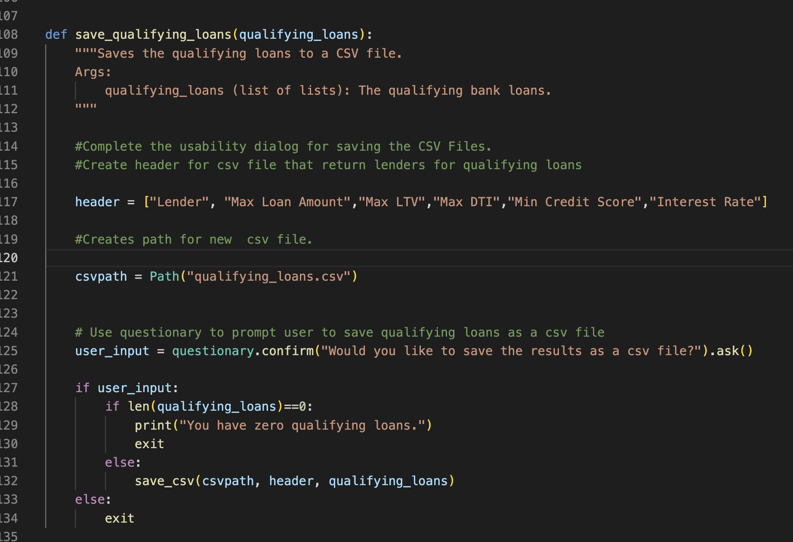
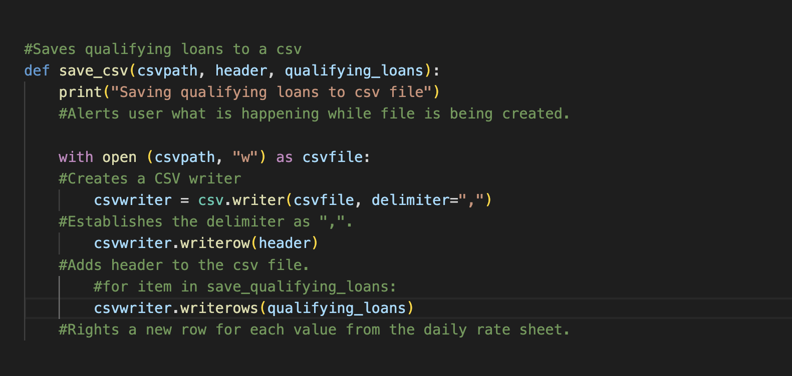
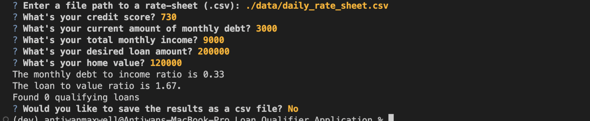

# Loan Qualifier Application

The loan qualifier is a command line application that helps potential borrowers find qualifying loans with lending institutiions upon meeting certain required financial criteria. The application uses a csv file named "daily_rate_sheet.csv" from various loan providers along with interactive prompts to determine a borrowers loan eligibility. Upon find qualifying loans the application provides the potential borrower  with the option to save the results as a csv file.  

---

## Technologies

This project leverages python 3.7 with the following packages:

* [fire](https://github.com/google/python-fire) - For the command line interface, help page, and entrypoint.

* [questionary](https://github.com/tmbo/questionary) - For interactive user prompts and dialogs

* Visual Studio Code Version: 1.70.2 (Universal)
Commit: e4503b30fc78200f846c62cf8091b76ff5547662
Date: 2022-08-16T05:36:37.829Z
Electron: 18.3.5
Chromium: 100.0.4896.160
Node.js: 16.13.2
V8: 10.0.139.17-electron.0
OS: Darwin arm64 21.4.0

---

## Installation Guide

Before running the application first install the following dependencies.

```python
  pip install fire
  pip install questionary
  import csv
```
Create a qualifying loans function that allows the applicant to save the results to csv.



Create save csv function to save file


## Usage

To use the loan qualifier application simply clone the repository and run the **app.py** with:

```python
python app.py
```

Upon launching the loan qualifier application you will be greeted with the following prompts.
In the following image the applicant has opted to save the qualifying loans to a csv. Once complete the program will close.


In the following image the applicant has opted not to save the qualifying loans to a cvs and the program will close. 





In the following image the applicant has entered in an incorrect file path a recieves an error message.


---
---


## Contributors

Antiwan Maxwell

---

## License

MIT
